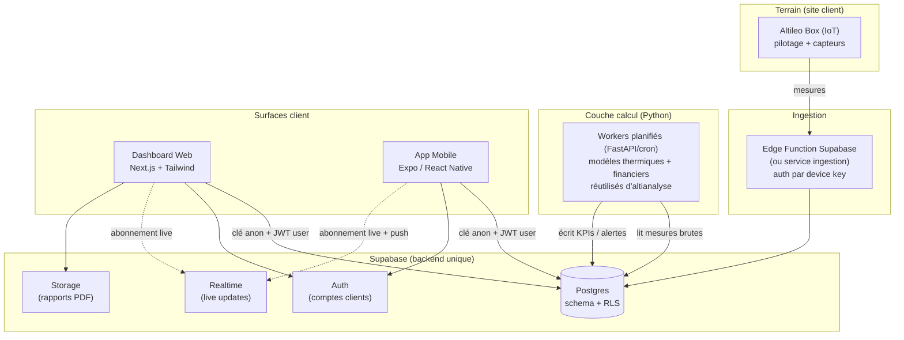

# Altileo — Plateforme de supervision client

**Blueprint d'architecture pour le produit temps réel destiné aux clients**
Version 0.1 — document de travail (à faire évoluer avant le premier commit de code)

> Ce document décrit comment transformer le **prototype de dashboard démo**
> (`client_dashboard_demo.py`, données statiques) en un **produit multi-client
> réel** : un dashboard web + une application mobile, connectés au Supabase
> Altileo, où chaque client suit uniquement ses propres installations.
>
> Il ne s'agit PAS de l'outil d'audit interne `altianalyse` (Streamlit), qui
> reste tel quel. Les deux partagent la charte « Frost & Carbon » et, à terme,
> les mêmes algorithmes de calcul (voir §7).

---

## 1 — Objectif & périmètre

**Ce qu'on construit :** une plateforme SaaS où un client d'Altileo (grossiste,
logisticien, industriel) se connecte et visualise en temps réel l'état de ses
chambres froides pilotées par l'Altileo Box : températures, consommation,
stockage thermique, économies, conformité HACCP, alertes.

**Deux surfaces client :**
1. **Dashboard web** — supervision complète sur écran large (poste de travail).
2. **Application mobile** — suivi + alertes push en déplacement.

**Une contrainte non négociable :** l'**isolation des données entre clients**.
Le client A ne doit jamais pouvoir accéder aux données du client B. C'est la
décision structurante n°1 (voir §3).

**Hors périmètre de ce document :** le firmware de l'Altileo Box, le moteur
d'optimisation embarqué (edge), la facturation. On décrit leurs points
d'interface, pas leur implémentation.

---

## 2 — Recommandation de stack (résumé)

| Couche | Choix recommandé | Pourquoi |
|---|---|---|
| **Backend / données** | **Supabase** (déjà en place) | Postgres + Auth + Realtime + RLS + Storage en un seul service ; l'isolation multi-client se fait « presque gratuitement » via Row-Level Security |
| **Dashboard web** | **Next.js 14+ (App Router) + TypeScript + Tailwind** | La charte est littéralement écrite pour ce stack (`tailwind.config.ts`, `lucide-react`, `var(--font-inter)`, `globals.css`) ; le prototype est déjà en Tailwind/Chart.js |
| **App mobile** | **React Native via Expo + TypeScript** | Partage le langage, le client Supabase, les tokens de design et la logique métier avec le web ; notifications push natives (alertes) |
| **Couche calcul** | **Service Python (FastAPI + workers planifiés)** | Réutilise les algorithmes thermiques/financiers **déjà validés** dans `altianalyse` plutôt que de les réécrire |
| **Monorepo** | **Turborepo + pnpm workspaces** | Un seul dépôt web + mobile + packages partagés → code réutilisé pour une petite équipe |
| **Hébergement web** | **Vercel** (natif Next.js) | Déploiement continu, edge, preview par PR |
| **Build mobile** | **EAS Build (Expo)** → App Store / Play Store | Pipeline standard Expo |

> **Pourquoi TypeScript côté client alors que l'équipe est Python ?** Parce que
> (a) la charte et le site web sont déjà orientés Next/Tailwind, (b) le même
> code TS tourne sur web ET mobile, (c) Supabase a un SDK TS de première
> classe. La logique métier lourde reste en Python (§7), exécutée côté serveur.

### Alternative pragmatique à considérer (fork de décision)

Si l'équipe veut **livrer plus vite avec moins de surface** au départ : faire le
web en **PWA installable** (Next.js responsive + manifest + service worker) et
**repousser l'app native**. Une PWA se « pose » sur l'écran d'accueil du
téléphone et couvre 80 % du besoin mobile sans passer par les stores.
L'app React Native reste la cible finale (notifications push riches, meilleure
intégration OS), mais peut venir en phase 4. → à trancher (§14).

---

## 3 — Décision n°1 : multi-tenant & sécurité (le point critique)

### État actuel (à ne PAS reproduire en production)

- Une clé Supabase unique donne accès à **toutes** les tables.
- Une **table par client** (`mesures_fady`), sélectionnable librement.
- Aucune authentification, aucune isolation.

C'est acceptable pour un outil interne mono-utilisateur. **En produit client,
c'est une fuite de données garantie.**

### Cible : un schéma unique + Row-Level Security (RLS)

Le modèle Supabase/Postgres natif pour le multi-tenant :

1. **Une seule table `measurements`** (et non une par client), avec une colonne
   `site_id` sur chaque ligne.
2. **Authentification** : chaque utilisateur client a un compte Supabase Auth.
3. **Table d'appartenance** `memberships (user_id, organization_id, role)`.
4. **Politiques RLS** : Postgres filtre automatiquement chaque requête pour ne
   renvoyer que les lignes des sites appartenant à l'organisation de
   l'utilisateur connecté. Exemple de politique :

   ```sql
   -- L'utilisateur ne voit que les mesures des sites de son organisation
   create policy "measurements_read_own_org"
   on measurements for select
   using (
     site_id in (
       select s.id from sites s
       join memberships m on m.organization_id = s.organization_id
       where m.user_id = auth.uid()
     )
   );
   ```

5. **Le front n'utilise JAMAIS la clé de service.** Web et mobile utilisent la
   **clé anon + le JWT de l'utilisateur connecté**. La clé de service reste
   confinée au backend (workers de calcul, ingestion).

> Conséquence : même si le front est compromis ou qu'un client bricole les
> requêtes, Postgres refuse au niveau base l'accès aux données d'un autre
> client. La sécurité ne dépend pas du code applicatif.

**Rôles** (colonne `role` de `memberships`) : `owner`, `admin`, `viewer` —
pour, plus tard, distinguer qui peut modifier des consignes vs seulement lire.

---

## 4 — Modèle de données (schéma cible)

Passage du schéma plat actuel (`timestamp, capteur, valeur`) à un schéma
relationnel propre. Tables principales (Postgres / Supabase) :

```
organizations        (id, nom, created_at)                      -- le client
  └─ sites           (id, organization_id, nom, adresse, timezone)   -- ex: Rungis - Entrepôt A
       └─ equipment  (id, site_id, nom, type, puissance_kw)          -- ex: Chambre A1
            └─ sensors (id, equipment_id, type, unite, capteur_ref)  -- ex: sonde temp, courant

measurements   (id, sensor_id, site_id, ts, value)   -- série temporelle brute
                                                       -- (partitionnée par mois, indexée (sensor_id, ts))

kpi_snapshots  (id, site_id, ts, conso_kwh, stockage_pct,        -- KPIs pré-calculés
                temp_moyenne, economies_eur, co2_evite_kg, ...)      par la couche calcul (§7)

alerts         (id, site_id, equipment_id, ts, niveau, message,  -- info/warning/danger
                statut)                                              acquittée ou non

optimization_events (id, site_id, ts, type, details)             -- délestage démarré/arrêté, recharge...

memberships    (user_id, organization_id, role)                  -- lien utilisateur ↔ client
```

**Notes de conception :**
- `site_id` est **dénormalisé sur `measurements`** (en plus de passer par
  `sensor_id`) pour que la politique RLS et les requêtes du dashboard soient
  simples et rapides.
- **Séries temporelles** : Supabase = Postgres standard (l'extension TimescaleDB
  n'est plus proposée sur les nouveaux projets). On utilise donc le
  **partitionnement natif par plage de temps** + des index `(sensor_id, ts)`,
  et des **rollups** (agrégats horaires/journaliers) calculés par `pg_cron`
  pour ne jamais faire scanner des millions de lignes brutes au dashboard.
- Les **KPIs affichés** (économies, CO₂, conformité) ne se recalculent pas à
  chaque affichage : ils sont figés dans `kpi_snapshots` par la couche calcul,
  et le dashboard ne fait que les lire (rapide + cohérent web/mobile).

---

## 5 — Architecture globale



Points clés :
- **Un seul point de vérité** : Supabase. Web, mobile et calcul convergent dessus.
- **Le front lit directement Postgres** (via PostgREST/SDK Supabase), sécurisé
  par RLS — pas besoin d'écrire une API REST maison pour la lecture.
- **La couche calcul écrit**, le front **lit**. Séparation nette.

---

## 6 — Temps réel

« Dashboard temps réel » = **Supabase Realtime** (réplication logique Postgres).

- Le front s'abonne aux changements de `kpi_snapshots` et `alerts` pour le site
  affiché → mise à jour live sans polling.
- **Ne pas** s'abonner à la table `measurements` brute (débit trop élevé) :
  s'abonner aux tables d'état agrégé/dérivé.
- Fallback : rafraîchissement périodique léger si l'abonnement tombe.

---

## 7 — Couche calcul (réutilisation des algorithmes existants)

C'est un atout majeur : les modèles **sont déjà écrits et validés** dans
`altianalyse` (modèle thermique asymptotique, calcul HC/HP, optimisation Spot,
CO₂). Il ne faut pas les réécrire en TypeScript.

**Plan :**
1. **Extraire** la logique métier de `app_v2.py` dans un **package Python
   réutilisable** (`altileo-core-py`) : fonctions pures (thermique, tarifs,
   agrégations), sans Streamlit.
2. Ce package devient la **source unique** utilisée à la fois par :
   - l'outil d'audit `altianalyse` (qui l'importe au lieu d'avoir le code inline) ;
   - le **worker de calcul** de la plateforme client.
3. Le **worker** (FastAPI + tâches planifiées, ou simple script cron) :
   - lit les mesures brutes depuis Supabase (clé de service) ;
   - calcule les KPIs (économies, CO₂, conformité) et détecte les alertes ;
   - écrit `kpi_snapshots` et `alerts`.
   - Hébergement : Fly.io / Railway / Render / petite VM. Déclenchement : `pg_cron`
     appelant une Edge Function, ou un scheduler externe.

> Bénéfice : un seul jeu d'algorithmes validés, testé une fois, partagé entre
> l'outil de vente interne et le produit client. Zéro divergence de chiffres
> entre l'audit commercial et le suivi réel.

---

## 8 — Ingestion (Altileo Box → Cloud)

Comment les mesures arrivent dans Supabase (à préciser avec l'équipe firmware) :

- **Option recommandée** : la Box envoie ses mesures (batch HTTP) à une
  **Edge Function Supabase** authentifiée par une **clé de device** ;
  la fonction valide et insère dans `measurements`.
- Alternatives : écriture directe via un rôle Postgres scellé au device, ou
  broker MQTT + service d'ingestion. À arbitrer selon le firmware existant.
- Chaque device est rattaché à un `site_id` → les mesures héritent du bon
  tenant dès l'insertion.

---

## 9 — Dashboard web (Next.js)

- **Next.js 14+ App Router**, TypeScript, Tailwind (tokens de la charte §14 du
  guide graphique : carbon `#111111`, teal `#00A4B4`, etc.).
- **Auth** : `@supabase/ssr` (sessions côté serveur, cookies sécurisés).
- **Données** : `@supabase/supabase-js` avec la clé anon + session utilisateur.
- **Graphiques** : Recharts (idiomatique React) ou `react-chartjs-2` (réutilise
  le travail Chart.js du prototype). La **mise en forme des données** est
  partagée avec le mobile via `packages/core`.
- **Icônes** : `lucide-react` (déjà la référence de la charte).
- **Déploiement** : Vercel, preview automatique par PR.

Le prototype `client_dashboard_demo.py` sert de **maquette de référence
visuelle** : on reproduit sa mise en page (sidebar, KPIs, graphique double-axe,
grille de chambres) en composants React branchés sur les vraies données.

---

## 10 — Application mobile (Expo / React Native)

- **Expo + React Native + TypeScript**.
- **Auth & données** : même `@supabase/supabase-js`, mêmes politiques RLS que le
  web → aucune logique de sécurité à redévelopper.
- **Graphiques** : `victory-native` ou `react-native-gifted-charts` (les libs
  web ne tournent pas en RN ; seule la logique de données est partagée).
- **Notifications push** : Expo Notifications → alertes (dérive thermique,
  seuil HACCP approché, panne). C'est LA valeur ajoutée du mobile vs web.
- **Build / distribution** : EAS Build → TestFlight / Play Console.

---

## 11 — Monorepo — arborescence cible

Un dépôt **séparé** de `altianalyse` (audiences et cycles différents), p.ex.
`altileo-platform` :

```
altileo-platform/
├─ apps/
│  ├─ web/                    # Next.js — dashboard web client
│  │  ├─ app/                 # routes App Router (login, dashboard, site/[id]...)
│  │  ├─ components/
│  │  └─ lib/supabase/
│  └─ mobile/                 # Expo — app React Native
│     ├─ app/                 # écrans (expo-router)
│     └─ components/
│
├─ packages/
│  ├─ ui/                     # tokens de design "Frost & Carbon" + composants partageables
│  ├─ supabase/               # client typé + types générés depuis le schéma DB
│  ├─ core/                   # logique partagée TS (formatage FR, mise en forme des séries, constantes)
│  └─ config/                 # eslint / tsconfig / tailwind preset partagés
│
├─ supabase/
│  ├─ migrations/             # schéma SQL versionné (tables, index, partitions)
│  ├─ policies/               # politiques RLS
│  └─ functions/              # Edge Functions (ingestion, notifications)
│
├─ services/
│  └─ compute/                # worker Python (FastAPI) — importe altileo-core-py
│
├─ turbo.json
├─ pnpm-workspace.yaml
└─ package.json
```

Et, côté Python, un package extrait de l'outil d'audit :

```
altileo-core-py/              # (peut vivre dans son propre dépôt ou dans services/)
├─ altileo_core/
│  ├─ thermique.py            # modèle asymptotique (extrait d'app_v2.py)
│  ├─ tarifs.py               # HC/HP, TURPE, taxes
│  ├─ spot.py                 # optimisation Spot
│  └─ co2.py                  # facteur d'émission
└─ tests/                     # tests unitaires des algorithmes (aujourd'hui inexistants)
```

---

## 12 — Design system partagé

- Les **tokens** de la charte (couleurs, typo, rayons, ombres) vivent dans
  `packages/ui` et sont consommés par le web (preset Tailwind) et le mobile
  (objet de thème RN) → **une seule source** pour les deux surfaces.
- Polices : **Inter** (texte) + **JetBrains Mono** (données/chiffres, tabular).
- Icônes : **Lucide** (`lucide-react` web / `lucide-react-native` mobile).
- Registre **carbon** (fond sombre) pour le dashboard de supervision, conforme
  au prototype et à la charte (« le carbon prouve »).

---

## 13 — Roadmap par phases

| Phase | Contenu | Livrable |
|---|---|---|
| **0 — Fondations** | Nouveau dépôt monorepo ; schéma DB + migrations ; **RLS + Auth** ; extraction de `altileo-core-py` (+ premiers tests) | Base multi-tenant sécurisée, un client de test avec vraies données migrées |
| **1 — Web MVP** | Login + dashboard web lisant les **vraies** données d'un site (KPIs, graphique, chambres), en lecture seule | Dashboard web fonctionnel pour 1 client pilote (Rungis) |
| **2 — Couche calcul** | Worker Python : KPIs (économies, CO₂, conformité) + détection d'alertes écrits dans Supabase | Chiffres réels et cohérents avec l'audit |
| **3 — Temps réel** | Abonnements Realtime + historique/rollups + export PDF | Vrai « temps réel », performant |
| **4 — Mobile** | App Expo (mêmes données, RLS) + notifications push d'alertes | App téléphone en TestFlight/Play |
| **5 — Multi-site & rôles** | Plusieurs sites/organisations, rôles, onboarding client, facturation | Produit commercialisable |

---

## 14 — Décisions à valider avant de scaffolder

1. **Mobile** : app native Expo dès le départ, ou **PWA-first** (web installable)
   puis native en phase 4 ?
2. **Dépôt** : nouveau dépôt `altileo-platform` (recommandé) ou monorepo
   englobant aussi `altianalyse` ?
3. **Couche calcul** : worker Python réutilisant les algos (recommandé) ou tout
   recalculer côté Edge Functions TypeScript ?
4. **Supabase** : réutiliser le projet Supabase actuel (avec migration du schéma
   plat vers le schéma relationnel) ou repartir d'un projet propre pour le
   produit, et garder l'actuel pour l'audit interne ?

> Une fois ces 4 points tranchés, l'étape suivante concrète est le **scaffold de
> la Phase 0** : dépôt monorepo + migrations SQL du schéma + politiques RLS +
> extraction de `altileo-core-py`.
